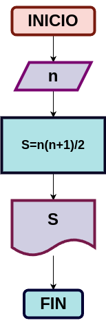

# Suma_n_numeros
suma de los n primeros numeros naturales

# Analisis

## Input

### Variables de entrada
n: numero al que se desea aplicar la formula
### prosesisng
p:
p= 2πr

a: area del circulo
a= πr

### output
a,p
# Diseño

# Construccion